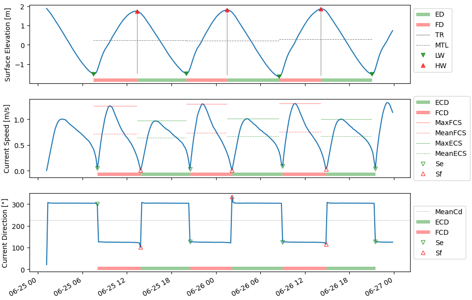

## Tide Analytics - A Python Tool for Analyzing Tidal Characteristics From Time Series Data

  

## Overview

The tide_analytics package is a Python library designed to analyze tidal characteristics from time series data. It provides a comprehensive set of functions and classes to extract and calculate various tidal parameters either on a single element (TidalSeries) or on a complete area (TidalArea). Currently the package supports to ingest the individual timeseries from MIKE .dfsu files. 

## Installation

You can git clone the package, browse to the tide_analytics folder and install it using pip:

`pip install -e .`

## Usage

For detailed usage examples and documentation, please refer to the [notebooks](notebooks/) directory.

## Tidal Characteristics

The tide_analytics package can calculate the following tidal characteristics:

| Abbreviation | Description              |
|--------------|--------------------------|
| MLW          | Mean Low Water           |
| MHW          | Mean High Water          |
| MTR          | Mean Tidal Range         |
| MTL          | Mean Tide Level          |
| ED           | Ebb Duration             |
| FD           | Flood Duration           |
| ECD          | Ebb Current Duration     |
| FCD          | Flood Current Duration   |
| MEANECS      | Mean Ebb Current Speed   |
| MEANFCS      | Mean Flood Current Speed |
| MAXECS       | Max Ebb Current Speed |
| MAXFCS       | Max Flood Current Speed |

  

## Errors

  

| Error | Description | Relevant Parameters |
|-------|-------------|----------------------|
| `NonAlternatingHWLWsError` | Raised when the high and low tides do not alternate. | `SE_DIF`, `SE_PROM` |
| `NotEnoughTidesError`      | Raised when the number of tides found is less than the minimum required. | `MIN_TIDES` |
| `NotEnoughWaterError`      | Raised when the percentage of NaN values in the surface elevation data exceeds the threshold or the total number of data points is less than the minimum required. | `THRSLD_NOWATER`, `MIN_DATA` |
| `NoSlackPointsFoundError`  | Raised when no slack points are found. | `CS_DIF`, `CS_PROM`, `CD_DIF` |
| `NoHWLWsFoundError`        | Raised when no high and low tides are found. | `SE_DIF`, `SE_PROM` |
| `CurrentsToNoisyError`     | Raised when the current direction data is too noisy to find the slack points. To detect the noise the DBSCAN algorithm is used. | `DBSCAN_EPS`, `DBSCAN_MINSAMPLES` |
| `NonMatchingSlackError`    | Raised when the slack points cannot be matched to the high and low tides. | `MATCH_TOL` |
| `FallsWetError`            | Raised when the element falls completely wet. This means the surface elevation does not change. | `THRSLD_WET_ERROR`, `TOL_WET_ERROR` |
| `FallsPartiallyDryError`   | Raised when the element falls partially dry. Is triggered when any Nan values are in the surface elevation data and no NotEnoughWaterError is raised before. | - |
| `FallsPartiallyWetError`   | Raised when the element falls partially wet. | `THRSLD_WET_WARNING` |

## Parameters

| Parameter | Description |
|-----------|-------------|
| `SE_DIF`  | Minimum distance between two consecutive peaks (or troughs) in the surface elevation to detect the high tides and low tides. The value should be set to slightly less than the expected duration of an ebb or flood. The default is 2 hours. |
| `SE_PROM` | Minimum prominence of the peaks in the surface elevation data. The default is `None`, which means no prominence filter is applied. |
| `CS_DIF`  | Minimum distance between two consecutive troughs in the current speed data to detect the slack points. The default is `None`, which means no filter is applied. |
| `CS_PROM` | Minimum prominence of the troughs in the current speed data. The default is `None`, which means no prominence filter is applied. |
| `CD_DIF`  | Minimum duration for a transition in the current direction data to be considered a valid slack point. The default is 1 hour. |
| `THRSLD_WET_ERROR` | Threshold for the percentage of identical surface elevation data points, above which the element is considered to produce and FallsWetError. The default is 0.4 (40%). |
| `TOL_WET_ERROR`    | Tolerance for considering surface elevation data points as identical. The default is 1e-4. |
| `THRSLD_WET_WARNING` | Threshold for the percentage of identical surface elevation data points, above which a warning is issued and the element is considered to produce and FallsPartiallyWetError. The default is 0.05 (5%). |
| `THRSLD_NOWATER`   | Threshold for the percentage of NaN values in the surface elevation data, above which the element is considered to provoke a NotEnoughWaterError. The default is 0.25 (25%). |
| `MIN_DATA`        | Minimum number of data points required for the analysis. The default is 10. |
| `MIN_TIDES`       | Minimum number of tides required for the analysis. The default is 3. |
| `MATCH_TOL`       | Time Tolerance for matching the slack points to the high and low tides. The default is `None`, which means no tolerance is applied. |
| `DBSCAN_EPS`      | Epsilon parameter for the DBSCAN algorithm used to check the current direction data for noise. The default is 10. |
| `DBSCAN_MINSAMPLES` | Minimum number of samples parameter for the DBSCAN algorithm. The default is 2. |

## Methods and Resources

The tide_analytics package uses the following methods and resources:

- [Hydrodynamische Entwicklung der Tideelbe](https://www.researchgate.net/publication/285868674_Hydrodynamische_Entwicklung_der_Tideelbe): This publication serves as a baseline for understanding tidal characteristics and how to analyze them. 
- [DBSCAN algorithm](https://scikit-learn.org/stable/modules/generated/sklearn.cluster.DBSCAN.html): The package uses the DBSCAN algorithm from the scikit-learn library to detect noise in the current data.
- [scipy.signal.find_peaks](https://docs.scipy.org/doc/scipy/reference/generated/scipy.signal.find_peaks.html): The package uses the `find_peaks` function from the SciPy library to identify the peaks and troughs in the surface elevation and current speed data.

## Contributing

We welcome contributions to the tide_analytics project. If you have any ideas, bug reports, or feature requests, please feel free to open an issue or submit a pull request.

## License

This project is licensed under the [MIT License](LICENSE).
